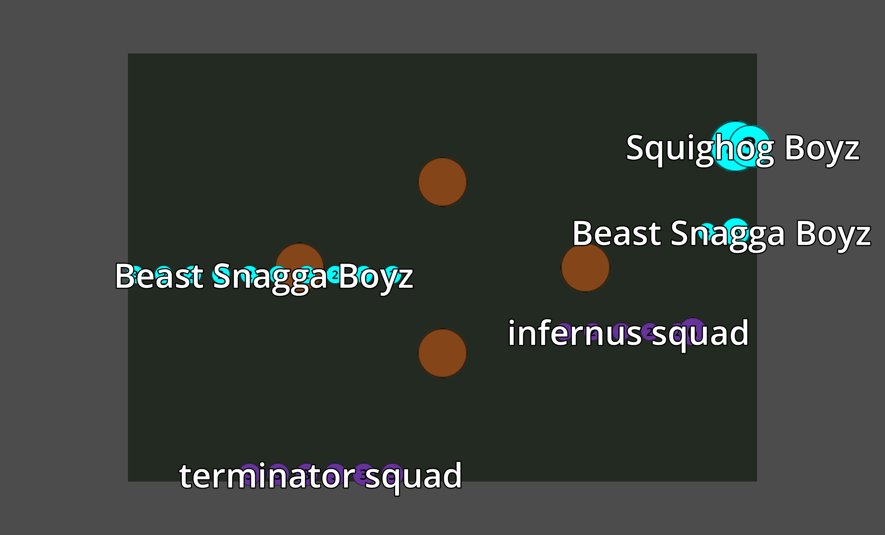
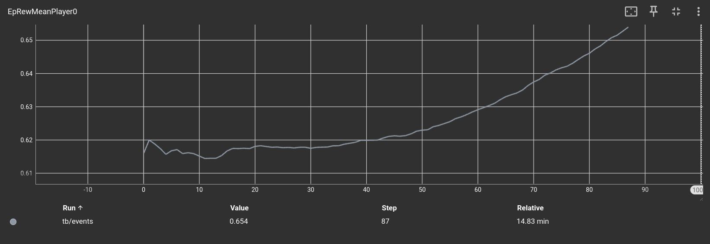
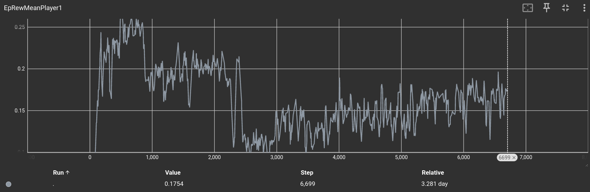

# 4Hammer

> A reinforcement learning environment implementing **Warhammer 40.000** **Combact patrol** game mode aimed at evaluation of deep learning algorithms, language models and more.




### Rationale

**Warhammer 40.00** tenth edition is a non-deterministic, zero-sum, boardgame played over multiple hours that require either
* a significant amount of ahead of time learning to fully learn all the rules of all game pieces of the game from trial and errors.
* the ability read natural language game pieces rules to understand how they would affect a given game state.

For this reason, creating a agent that plays well at the game is a fairly challenging task, as well us being a game in the 95 percentile of game rules complexity on [BBG](https://boardgamegeek.com/boardgame/386136/warhammer-40000-tenth-edition)

### Features

There are two main modes of using 4Hammer, the first is as a **headless mode** without a graphical engine, thus treating **4Hammer** as a library. The second mode is in **graphical mode**, where the state of the game is rendered on screen. The features of the two modes are the following:

#### Headless mode
* **6 Combact Patrol factions**: the current implementation contains 6 of the 35 currently existing combact patrol factions.
* **Python, C and CPP bidirectional interoperability**: all the headless mode features are available from the cited languages
* **Enumerable actions and valid actions**: it is possible to enumerate all the actions that can ever be executed in a game, as well as enumerating the valid actions that can be executed in a given state.
* **Textual and binary serializers for the game state**: the game state can be serialized to be displayed or stored.
* **Textual and binary serializers for action traces**: actions and lists of actions can be serialized to be displayed or stored.
* **Default machine learning serializer**: we provide a default machine learning serialization for the game state.the game state can be serialized to be displayed or stored.

#### Graphical model
* **Load any game state**: the graphical components are able to load a game state and yield a image rappresenting the game state.
* **Auto configuring graphical user interface**: modifications to the game sequences are automatically understood by the engine and correctly displayed.
* **Deploy on the web**: the graphical mode can be exported to web assembly and executed entirelly a browser.
---

### Running headless mode
```
# clone code, or download the src directory only
git clone https://github.com/drblallo/skirmish.git
cd skirmish

# setup rlc
python3 -m pip install virtualenv
python3 -m virtualenv .venv
source .venv/bin/activate.sh
pip install rl_language

# test that compiler works. It will take few seconds to compile the library.
rlc-random src/rules.rl
```

There are two examples you can read, placed in the examples directory.
* [gym\_jit\_example.py](./examples/gym_jit_example.py) shows the typical machine learning use case where the rules are just-in-time compiled once at the start of the program, and then interacted with a gym like interface.

```python
    env = SingleRLCEnvironment(program)
    while not env.is_done_underling():
        action_index = env.random_valid_action_index()
        print(program.to_string(env.actions()[action_index]))
        env.step(action_index)
```


* [use\_rules\_from\_python.py](./examples/use_rules_from_python.py) instead shows ahead of time compilation and direct function invocations and member accessing from python.

```
    state = rules.functions.play()
    print(rules.functions.size(state.board.reserve_units))
    rules.functions.pick_insidious_infiltrators(state)
    print(rules.functions.size(state.board.reserve_units))
```

You can find the doc of the currently supported mechanics [here](./doc), which you can visualize with any browser.


#### Learning

Since the rules are written in pure Rulebook language we can use the off-the-shelf implementation provided by rlc, while not efficiet enough learn from a whole game, if is good enough to learn from smaller situations, such as a single shooting sequence.

[Here](./examples/single_shooting_maximize.rl) you can find a simple script that shows how 4hammer rulebook code can be reused. That file contains a small sequence where a enemy unit is spawned, the player is asked to decide between two possible units, one of them is spawned and then the objective is to maximize the damage dealt to the opponent unit.

You can use
```
rlc-learn examples/single_shooting_maximize.rl -o /tmp/net -i src/ --steps-per-env 1000 --lr 0.00001
```
to have a network learn to maximize the given objective.


If you have the hardware, you can as well try to learn the full game. On the hardware available (NVIDIA GeForce RTX 4070, Intel(R) Core(TM) i7-9700K CPU @ 3.60GHz) to us we only managed to have it learn from playing a single turn, using `cd src && rlc-learn ../examples/single_turn.rl --steps-per-env 3500 --lr 0.00001 -i src/ --league-play `

Using this off-the-shelf implementation, we achieved the following (expected) poor results:




### Graphical Build Requirements

**Mandatory:**
- A Linux distribution (the project has been designed to work on any Godot-supported platform but those configurations are not supported off-the-shelf at the moment).
- scons
- Python 3.9+
- [RLC](https://github.com/rl-language/rlc/).
- CMake 3.10 or later.
- Godot 4.3.
- Ninja build system (make not supported at the moment)

**Optional (to run the project in a browser):**
- Emscripten 3.39 or later.
  *(Note: Using older versions of Emscripten will fail silently and the project will not load in the browser.)*

---

### Running the graphical mode

```bash
# clone and setup build directory
git clone https://github.com/drblallo/skirmish.git
cd skirmish
python3 -m pip install virtualenv
python3 -m virtualenv .venv
source .venv/bin/activate.sh
pip install rl_language
mkdir build
cd build
cmake .. -DGODOT_EDITOR=/PATH/TO/GODOT/EDITOR/EXECUTABLE -G Ninja

# build  the first build must be executed with -j 1 due to godot scons
ninja editor -j 1

# after the opening the editor for the first time you can simply execute
ninja run
```

If you don't want to jit the rules in your python scripts and you don't want to generate them by hand, you can just, from the build directory, run. It will create the files rules.py and lib.so.
```
ninja python_wrapper
```

#### Examples

You can find in the [graphical\_engine\_driver](./examples/graphical_engine_driver.py) the intended way of interacting with the godot server
```
    client = GodotClient()
    client.stop_rendering()

    while not client.state.is_done():
        action = client.get_random_valid_action()
        print(client.prog.to_string(action))
        client.send_action(action)

    img = client.get_image()
    if img != None:
        img.save("/tmp/img.png")
```

As shown in that example, if you want you can keep a client side copy of the game state, this allows you for example to enumerate the valid moves! When the engine detects a connection it sets a fixed zoom level and hides the user GUI as well. Unfortunatelly godot does not currently support offscreen rendering, when it will, we will provide a command line way of spawning godot in the right configuration immediately.

`client.stop_rendering`, configures godot to emit 1 frame whenever a command is sent from the network and does not render otherwise.

If you instead want to see the game play out, you can take a look at [llm\_to\_engine](./examples/llm_to_engine.py) example, which uses gemini 2.0 flash to play out a game and then render it on screen.

```
    with load_program_from_args(args) as program:
        client = GodotClient(program)
        llm = GeminiStateless(program)
        rules = get_included_conents_from_args(args)
        for (action, thought) in run_game(llm=llm, program=program, rules=rules):
            client.send_action(action)
            if len(thought) == 0:
                continue
            client.send_text_to_display(thought)
            sleep(1)
```

You can as well see a full game being played out [here](https://www.youtube.com/watch?v=T0Tj7zPuQVI). Once again, as expected, the results are fairly poor.


### Contacts

Join us at [Discord](https://discord.gg/saSEj9PAt3).

