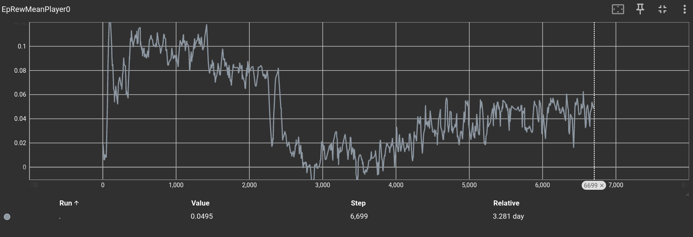

# 4Hammer

> A reinforcement learning environment implementing **Warhammer 40,000: Combat Patrol** game mode, designed for evaluating deep learning algorithms, language models, and more.


### Rationale

**Warhammer 40,000 (10th edition)** is a non-deterministic, zero-sum board game requiring several hours to play. Successfully playing it necessitates:
- Extensive upfront learning to master the numerous rules and interactions through trial and error.
- The capability to interpret complex natural language rules to determine their effects on game states.

Creating an agent that excels at this game is challenging, as evidenced by its placement in the 95th percentile for complexity on [BoardGameGeek](https://boardgamegeek.com/boardgame/386136/warhammer-40000-tenth-edition).

### Features

**4Hammer** can be utilized in two primary modes:

#### Headless Mode
- **Six Combat Patrol Factions**: Currently includes 6 of the existing 35 Combat Patrol factions.
- **Python, C, and C++ Interoperability**: All features in headless mode are accessible from these languages.
- **Action Enumeration and Validation**: Ability to list all possible game actions and validate actions for given game states.
- **State Serialization**: Supports both textual and binary serialization for displaying or storing game states.
- **Action Trace Serialization**: Actions and action sequences can be serialized in both textual and binary formats.
- **Machine Learning Serializer**: A default serialization method optimized for machine learning applications is provided.

#### Graphical Mode
- **Game State Loading**: Capable of rendering any given game state visually.
- **Auto-Configuring GUI**: Automatically adapts the visual interface based on game sequence modifications.
- **Web Deployment**: Exportable to WebAssembly, allowing execution directly within browsers.

---

### Running Headless Mode

```bash
# Clone the repository
git clone https://github.com/rl-language/4Hammer
cd 4Hammer

# Setup Python environment
python3 -m pip install virtualenv
python3 -m virtualenv .venv
source .venv/bin/activate
pip install rl_language

# Test the compiler (compilation takes a few seconds)
rlc-random src/full_game.rl
```

Examples can be found in the `examples` directory:
- [gym\_jit\_example.py](./examples/gym_jit_example.py): Demonstrates typical ML usage with just-in-time rule compilation and interaction via a gym-like interface. The scripts expects to be run from the root of the repository, not not from the example directory.

```python
env = SingleRLCEnvironment(program)
while not env.is_done_underling():
    action_index = env.random_valid_action_index()
    print(program.to_string(env.actions()[action_index]))
    env.step(action_index)
```

- [use\_rules\_from\_python.py](./examples/use_rules_from_python.py): Illustrates ahead-of-time compilation and direct function invocation from Python. Yout need to compile the libraries by hand with

```bash
rlc src/full_game.rl  -o examples/lib.so -O2 --shared # compile rules library
rlc src/full_game.rl -o examples/wrapper.py --python # emit the wrapper
python examples/use_rules_from_python.py  # executes the example
```

The example shows that you can inspect the content of the rules directly from python.
```python
state = rules.play()
print(state.board.reserve_units.size())
rules.can_pick_insidious_infiltrators(state)
rules.pick_insidious_infiltrators(state)
print(state.board.reserve_units.size())
```

Detailed documentation of supported mechanics is available [here](./doc).

#### Learning

The provided rule set, written in pure Rulebook Language, leverages the existing implementation provided by RLC. While not efficient enough for entire game learning, it effectively handles smaller scenarios like single shooting sequences.

An example of maximizing shooting damage is available [here](./examples/single_shooting_maximize.rl):

```bash
rlc-learn examples/single_shooting_maximize.rl -o /tmp/net -i src/ --steps-per-env 1000 --lr 0.00001
```


Attempting to learn from a full game (tested on NVIDIA RTX 4070, Intel Core i7-9700K CPU @ 3.60GHz) yielded modest results from playing a single turn:

```bash
cd src && rlc-learn ../examples/single_turn.rl --steps-per-env 3500 --lr 0.00001 -i src/ --league-play
```

Results:




---
Since it is a adversarial setup, players can always reduce the opponent score by being more conservative, so the end game returns displayed in the image do not always trend higher as you would expect from a single player game.

### Graphical Build Requirements

**Mandatory:**
- Linux distribution (other Godot-supported platforms are possible but currently unsupported).
- scons
- Python 3.9+
- [RLC](https://github.com/rl-language/rlc/)
- CMake 3.10+
- Godot 4.3

**Optional (for browser deployment):**
- Emscripten 3.39+ (older versions silently fail).

---

### Running Graphical Mode

```bash
# Clone repository and setup

 git clone https://github.com/rl-language/4Hammer
 cd 4Hammer
 python3 -m pip install virtualenv
 python3 -m virtualenv .venv
 source .venv/bin/activate
 pip install rl_language
 mkdir build
 cd build
 cmake .. -DGODOT_EDITOR=/PATH/TO/GODOT/EDITOR/EXECUTABLE -G Ninja

# YOU MUST RUN THIS ONCE TO GET GODOT TO BUILD THE PROJECT, AND TO BUILD
# THE 4Hammer PLUGIN
#
# -j 1 is necessary because of issues with scons
make editor -j 1

# Run after initial build you can skip spawning the editor
make run
```

To generate Python wrappers without JIT compilation:

```bash
ninja python_wrapper
```

#### Examples

Interaction with Godot server demonstrated in [graphical\_engine\_driver.py](./examples/graphical_engine_driver.py):

From two different shells
```bash
# shell 1
cd build
make run

# shell 2
python ./examples/graphical_engine_driver.py
```

You will see the game being played out at random in the graphical engine.

```python
client = GodotClient()
client.stop_rendering()

while not client.state.is_done():
    action = client.get_random_valid_action()
    print(client.prog.to_string(action))
    client.send_action(action)

img = client.get_image()
if img:
    img.save("/tmp/img.png")
```

This example shows that you can keep a client side copy of the game state, this allows you for example to enumerate the valid moves! When the engine detects a connection it sets a fixed zoom level and hides the user GUI as well. Unfortunatelly godot does not currently support offscreen rendering, when it will, we will provide a command line way of spawning godot in the right configuration immediately.

`client.stop_rendering`, configures godot to emit 1 frame whenever a command is sent from the network and does not render otherwise.

If you instead want to see the game play out, you can take a look at [llm\_to\_engine](./examples/llm_to_engine.py) example, which uses gemini 2.0 flash to play out a game and then render it on screen.

```bash
# shell 1
cd build
make run

# shell 2
pip install google-genai # you will have to set you gemini API key
python ./examples/llvm_to_engine.py src/full_game.rl
```

```python
with load_program_from_args(args) as program:
        client = GodotClient(program)
        llm = GeminiStateless(program)
        rules = get_included_conents_from_args(args)
        for (action, thought) in run_game(llm=llm, program=program, rules=rules):
            client.send_action(action)
            if len(thought) == 0:
                continue
            client.send_text_to_display(thought)
            sleep(1)
```

Full gameplay demonstration available [here](https://www.youtube.com/watch?v=T0Tj7zPuQVI).

---

### Contacts

Join us on [Discord](https://discord.gg/saSEj9PAt3) or mail us at massimo.fioravanti@polimi.it


