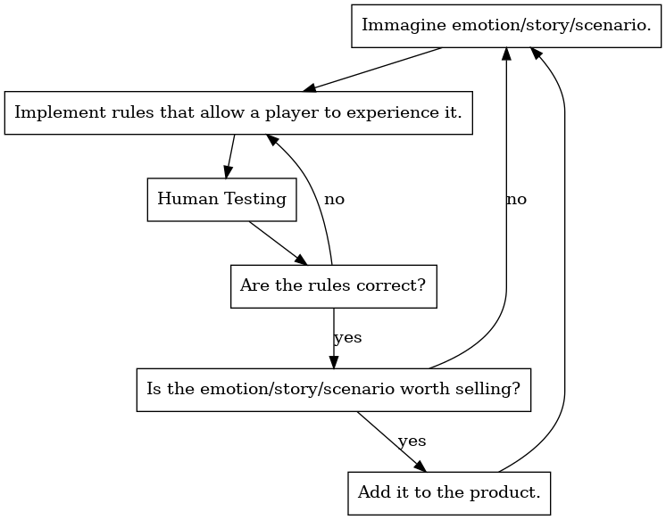
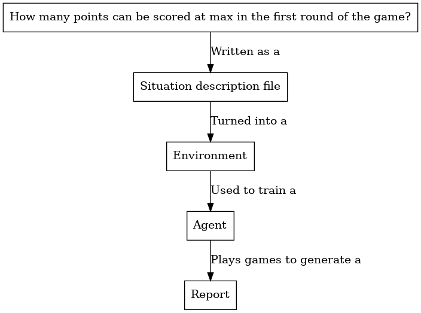
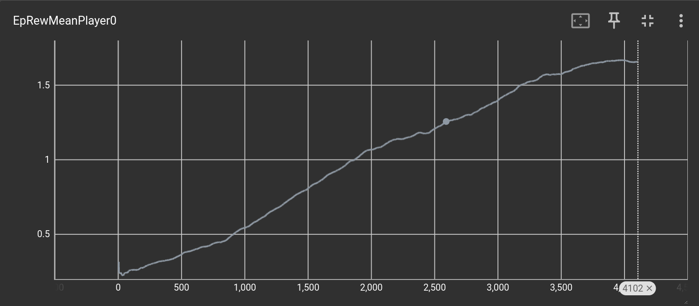
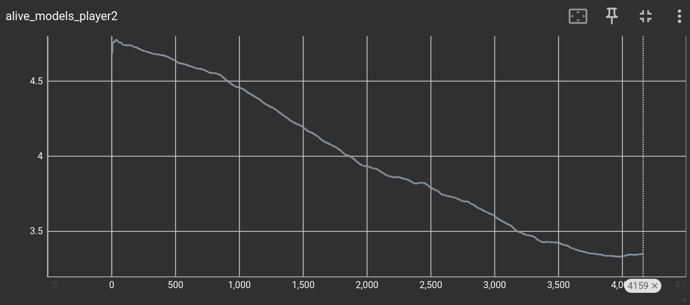

**Tool-Assisted Game Design**


> CC BY-SA 4.0 - Matthew Kirschenbaum


Game design has historically been a difficult discipline to automate. Consider the typical design loop composed of the following steps:
1. A **planning stage**, where the subject of the design is selected.
2. An **implementation stage**, where concrete rules are chosen.
3. A **testing step**, where these concrete mechanics are evaluated.

These three steps are repeated until a good design is found and then committed to the final product. After that, the loop begins again.



The **testing** step is central to the entire process. Due to the iterative nature of game design, testing becomes the core bottleneck stopping the designer to take decisions until data is collected.
Unfortunately, it is difficult to automate beyond human testing:

* Human predictions of how game mechanics will play out in practice are often wrong, making testing necessary to ensure things happen as intended.
* Interesting games often have emergent complexity by design; in other words, the game designer intends for the optimal way to play to be difficult to find.
* The feelings evoked in human players are difficult to predict.
* If the game is physical, it can be challenging to produce a digital implementation that allows for automated testing.
* If the game is digital, it is often impossible to separate a sometimes simple game from a more complex graphical engine, making it difficult to test and analyze the game independently of the engine.

In practice, these points can be summarized by the following heuristic:
> *If a game is so simple that it does not require manual testing, then it is so simple that it is not of interest to players.*
Thus, testing cannot be really avoided.

### Automatizing testing
As we said, testing is mandatory, not optional. Therefore, we want to automatize as much testing as possible.

Of course, even in an ideal world, not all types of tests can be automated. It will always be worthwhile to see how real human players react to the complete game. In the end, they are the customers, and the game must appeal to them. Similarly, certain tests inherently relate to human emotions—questions like: “How many cards can a player discard from their hand before feeling frustrated?” or “Does this mechanic evoke a sense of excitement?”

Yet, those types of questions do not represent the majority of what game designers usually ask. Most questions are along the lines of: “How many cards should this game have to ensure it ends, on average, in five turns?” or “What is the maximum number of points I can score in the first round of the game?” These are technical questions about the practical properties of the game, for which an experiment can be concretely designed and an exact answer provided.

For the rest of this document, we will see how we have combined various pieces of new technology to create a tool that accomplishes the tasks described above.





### Example

Let us pick a concrete example.

Consider the problem of balancing [war games](https://en.wikipedia.org/wiki/Wargame) . We chose this subject because war games are relatively straightforward to conceptualize: two players take turns moving their armies and units on a map, trying to achieve objectives while preventing their opponents from doing the same.

A designer might ask questions such as “How many enemy units can I destroy on average with this unit?” or “How quickly can I reach that hill?”—all of which are important for guiding development. An example of such a situation is what we will show in this document.

#### Which Game Did We Pick?

We have chosen [Warhammer 40,000](https://www.warhammer-community.com/en-gb/downloads/warhammer-40000/) as the subject for this demo for several reasons:

* The game is well known.
* As far as we know, it lacks any official digital implementation for testing purposes. The best tools available are programs like [Unit Crunch](https://www.unitcrunch.com), which simply automate dice rolling for certain common actions.
* The game ranks in the top 50% of complexities.

We have created a digital implementation of a subset of Warhammer 40,000 using our technology, allowing experiments to be written extremely quickly. Naturally, we have not implemented all Warhammer 40,000 rules (which include at least a thousand different units with different stats). Instead, we focused on rules needed to implement a freely available subset of the game called **Combat Patrol**, which includes all basic rules but a smaller set of possible units. We specifically implemented only four units. Expanding support to multiple units would be trivial (though time-consuming). Similarly, we have not implemented the rules found in the online FAQ and updated documentation. We used the Core Rules document as understood at the time, recognizing that FAQ and Rules documents are often updated.

Combat Patrol games are also played on a smaller board, which makes them easier for machine learning components to manage, but that change doesn’t really affect anything else beyond testing, so it serves as a good proof of concept.

##### Running Experiments

Imagine that a designer for *Warhammer 40,000* wants to answer the following question:

**When player one has 1 command point, which unit—between a Terminator Squad and an Infernus Squad—destroys the largest number of models in a single attack volley against a Infernus squad at 12 inches away?**

Don’t worry about the precise meaning of “Terminator Squad,” “Infernus Squad,” and so on—just know they can shoot each other, and if more members of the target squad are destroyed, that’s better for the shooter.

This natural-language description is equivalent to the short formal scenario below:

```
act play() -> Game:
    frm board : Board
    board.command_points[0] = 1
    board.command_points[1] = 0

    # Player 0 chooses their unit
    let unit : Unit
    actions:
        act select_infernus_squad()
            unit = make_infernus_squad()
        act select_terminator_squad()
            unit = make_terminator_squad()

    unit.owned_by_player1 = false
    board.units.append(unit)

    # Player 1's Infernus Squad
    let enemy_unit = make_infernus_squad()
    enemy_unit.owned_by_player1 = true
    board.units.append(enemy_unit)

    # Deploy units 12 inches apart
    board.units[0].move_to(make_board_position(0, 0))
    board.units[0].arrange()
    board.units[1].move_to(make_board_position(0, 12))
    board.units[1].arrange()

    # Player 0 performs a ranged attack
    board.current_decision_maker = false  # Player 0's turn
    subaction*(board) attack_action = attack(board, 0, 1, false, false)

fun score(Game g, Int player_id) -> Float:
    let count = g.board.units[1].models.size()
    if player_id == 0:
        # Player 0's score: models destroyed in player 1's unit
        return float(5 - count)
    else:
        # Player 1's score: models remaining in their unit
        return float(count)
```

That’s all it takes. From this description, it is possible to:

* Generate an editor that can run in the browser.


* Generate an agent to test and maximize the scenario’s score. In this case we can see that the agent, while learning to play the game, obtained a final score of 1.5 destroyed models.


* Measure the important metrics, in this case we can then measure how many models are left in the target unit when the agent is playing.


In short, our technology requires only about 40 lines of code to perform an experiment that no other existing implementation can achieve.
